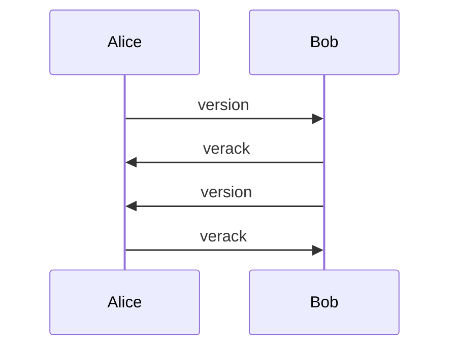
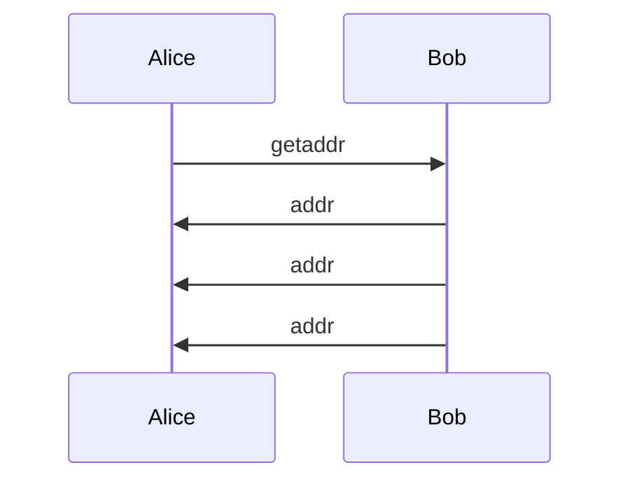
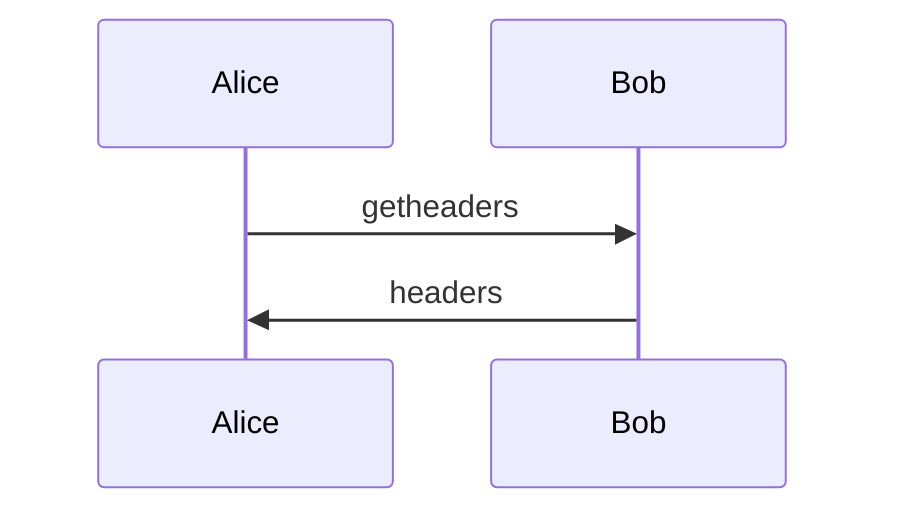
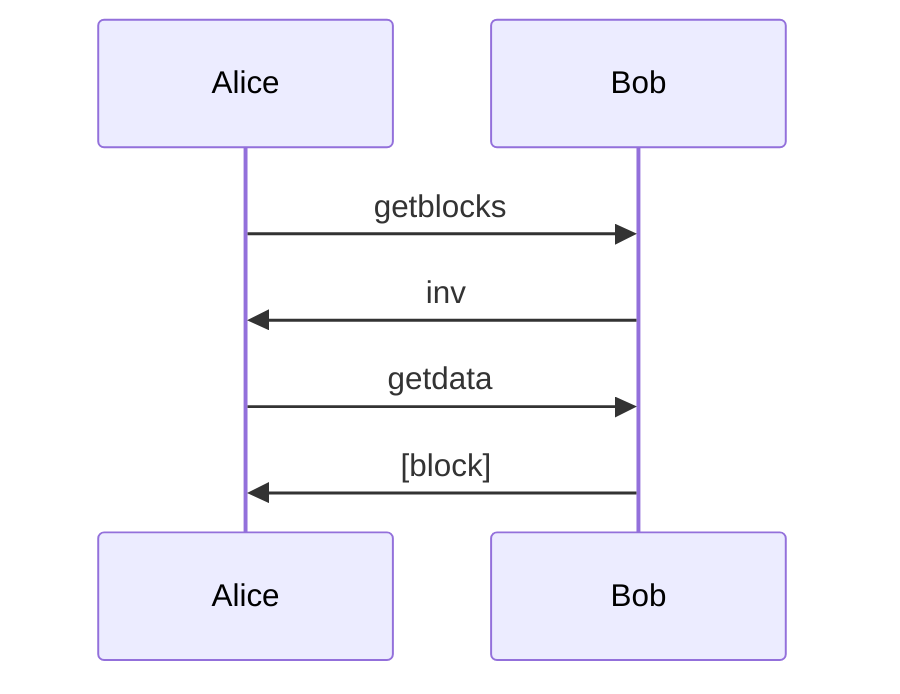
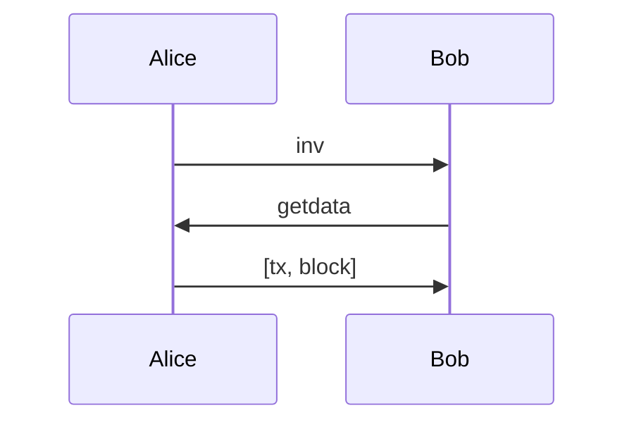
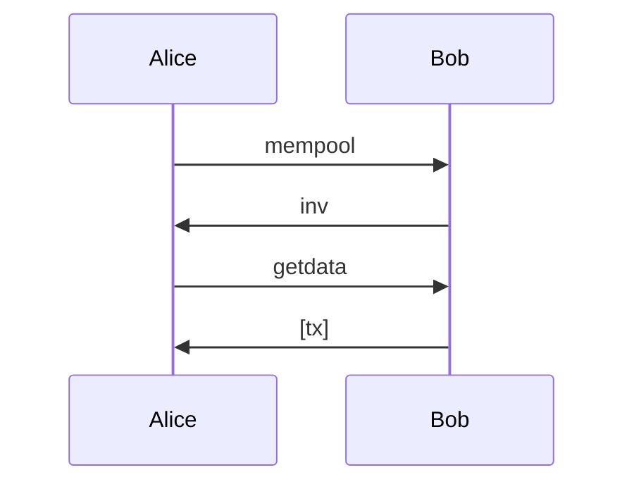
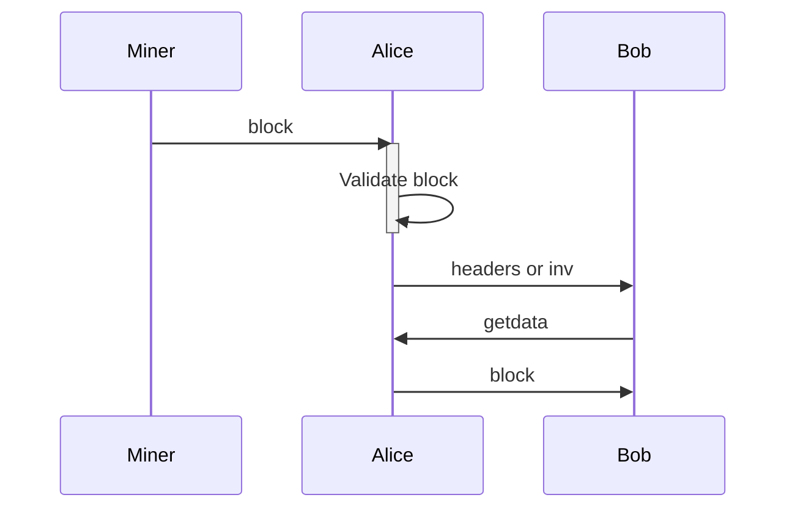
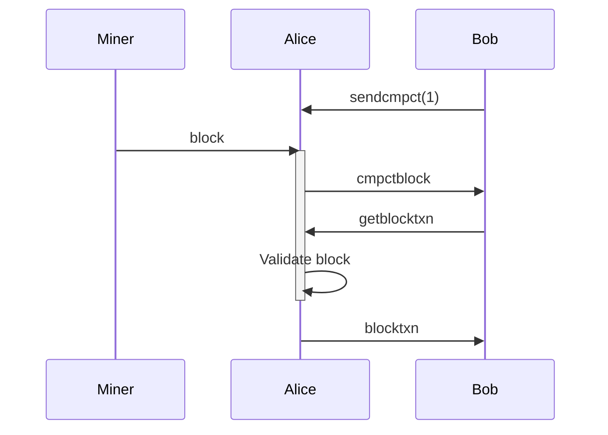
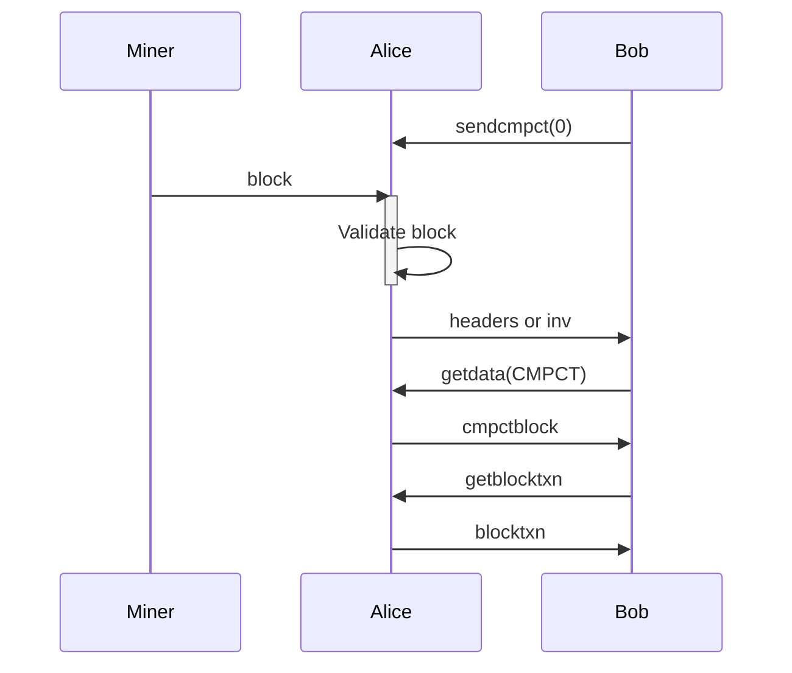

# Sequence Diagrams of the Bitcoin P2P Protocol

## Handshake

## Address propagation

## IBD

Headers only

Blocks

## Normal tx and block announcement

Normal tx and block announcement

## Mempool

## Compact block

High bandwidth

Low bandwidth

